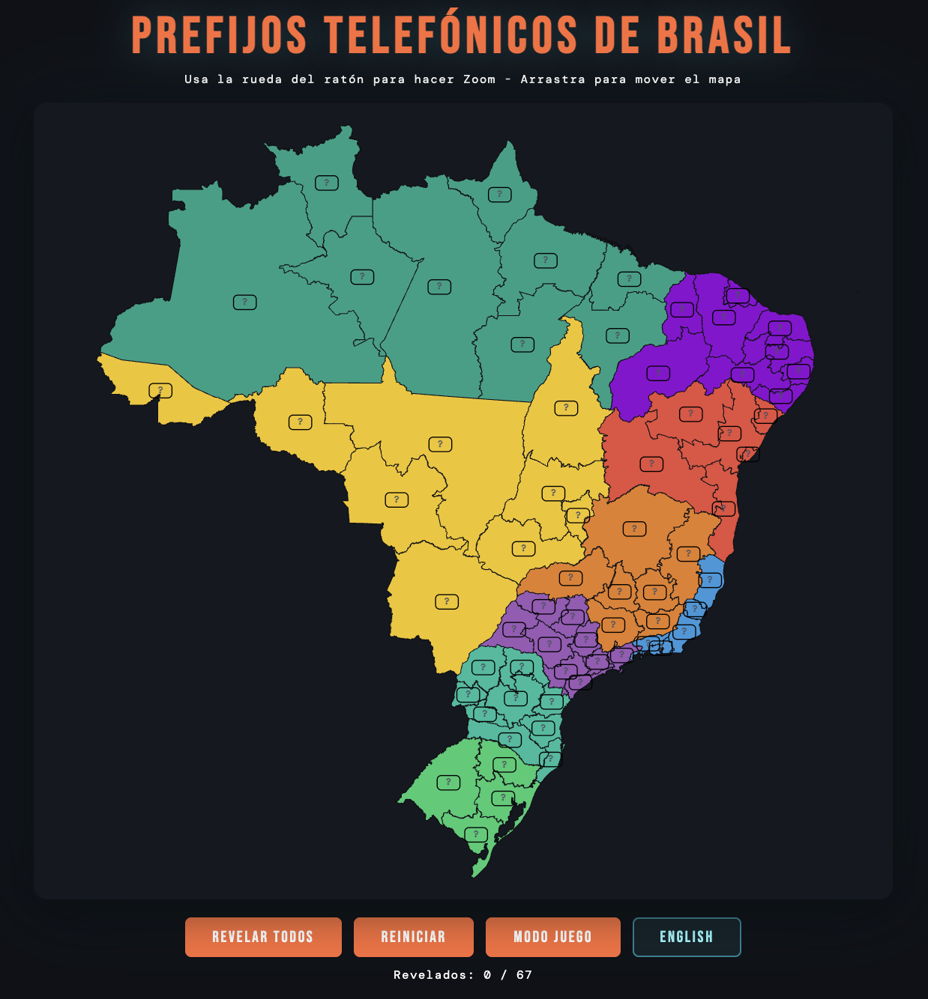
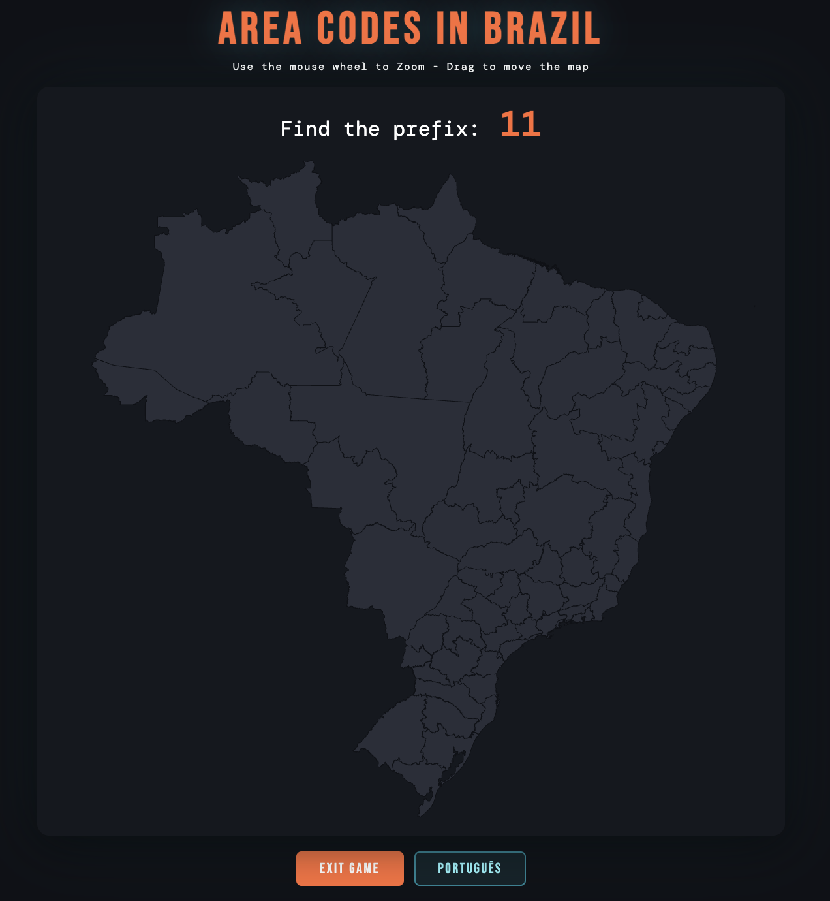

# 🇧🇷 Brazil Area Codes - Interactive Map

An interactive and visual way to learn and memorize Brazil's area codes (DDD - *Discagem Direta a Distância*), perfect for GeoGuessr players.

## 🎮 Play it now

[Live Preview](https://illera03.github.io/area-codes-brazil/)

## ✨ Features

* **Interactive Map:** Color-coded by macro-regions (first digit) for easier memorization.
* **Game Mode:** Test your knowledge with two difficulties:
  * **Easy:** Guess the macro-region based on the decade (e.g., 4x).
  * **Hard:** Guess the exact sub-region for a specific area code.
* **Multi-language:** Available in English, Spanish, and Portuguese.

## 🛠️ Technologies Used

* HTML5 / CSS3
* JavaScript (ES6+)
* [D3.js (v7)](https://d3js.org/) - For map rendering, geographic projections, and animations.
* GeoJSON - Brazil state borders data.

## 🚀 Local Installation

1. Clone this repository or download the files.
2. Open the `index.html` file in your browser.
   * *Note: Since the project uses D3.js to fetch external GeoJSON data (`d3.json`), some browsers might require you to run it through a local server (e.g., Live Server in VS Code or `python -m http.server`).*

## 🧠 Why learn Brazil DDDs for GeoGuessr?

Brazil is a massive country and often lacks clear road signs. However, phone numbers (with their corresponding area code) frequently appear on storefronts, billboards, and commercial vehicles. Knowing the DDD prefixes allows you to quickly deduce which region or state you are in.

---

---

# 🇧🇷 Prefijos de Brasil (DDD) - Mapa Interactivo

Una manera interactiva y visual de aprender y memorizar los prefijos telefónicos (DDD - *Discagem Direta a Distância*) de Brasil, ideal para jugadores de GeoGuessr.

## 🎮 Pruébalo ahora

[Jugar online](https://illera03.github.io/area-codes-brazil/)

## ✨ Características

* **Mapa Interactivo:** Coloreado por macro-regiones (primer dígito) para facilitar la memorización visual.
* **Modo Juego:** Pon a prueba tus conocimientos con dos dificultades:
  * **Fácil:** Adivina la macro-región basándote en la decena (ej. 4x).
  * **Difícil:** Adivina la subregión exacta para un prefijo concreto.
* **Multilingüe:** Interfaz disponible en Español, Inglés y Portugués.

## 🛠️ Tecnologías Utilizadas

* HTML5 / CSS3
* JavaScript (ES6+)
* [D3.js (v7)](https://d3js.org/) - Para el renderizado del mapa, proyecciones geográficas y animaciones.
* GeoJSON - Datos de las fronteras de los estados de Brasil.

## 🚀 Instalación y Uso Local

1. Clona este repositorio o descarga los archivos.
2. Abre el archivo `index.html` en tu navegador.
   * *Nota: Dado que el proyecto utiliza D3.js para hacer peticiones (`d3.json`) a un repositorio externo, es posible que algunos navegadores requieran que lo abras a través de un servidor local (ej. Live Server en VS Code o `python -m http.server`).*

## 🧠 ¿Por qué aprender los prefijos telefónicos de Brasil para GeoGuessr?

Brasil es un país gigantesco y a menudo carece de señales de tráfico claras. Sin embargo, los números de teléfono (con su correspondiente código de área) aparecen con mucha frecuencia en carteles de tiendas, vallas publicitarias y vehículos comerciales. Conocer los prefijos DDD te permite deducir rápidamente en qué región o estado te encuentras.

---

*Created for the GeoGuessr community.*