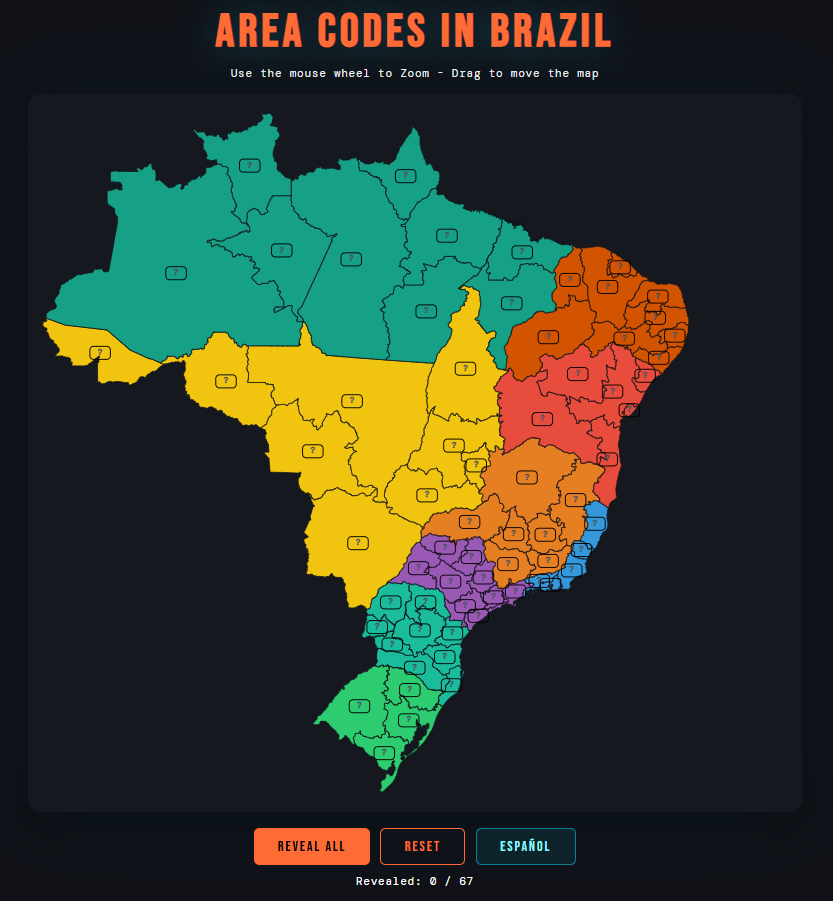

# area-codes-brazil

Una manera interactiva y visual de aprender y memorizar los prefijos telefónicos (DDD - *Discagem Direta a Distância*) de Brasil.

## 🎮 Pruébalo ahora

[Enlace a la página](https://illera03.github.io/area-codes-brazil/)

## 🛠️ Tecnologías Utilizadas

* HTML5 / CSS3
* JavaScript (ES6+)
* [D3.js (v7)](https://d3js.org/) - Para el renderizado del mapa, proyecciones geográficas y animaciones.
* GeoJSON - Datos de las fronteras de los estados de Brasil provenientes del repositorio público de *Code for America*.

## 🚀 Instalación y Uso Local

1.  Clona este repositorio o descarga el archivo `.html`.
2.  Abre el archivo `index.html` en tu navegador.
    * *Nota: Dado que el proyecto utiliza D3.js para hacer peticiones (`d3.json`) a un repositorio externo, es posible que algunos navegadores requieran que lo abras a través de un servidor local (ej. Live Server en VS Code o `python -m http.server`).*

## 🧠 ¿Por qué aprender los prefijos telefónicos de Brasil para GeoGuessr?

Brasil es un país gigantesco y a menudo carece de señales de tráfico claras. Sin embargo, los números de teléfono (con su correspondiente código de área) aparecen con mucha frecuencia en carteles de tiendas, vallas publicitarias y vehículos comerciales. Conocer los prefijos DDD te permite deducir rápidamente en qué región o estado te encuentras.

---

*Creado para la comunidad de GeoGuessr.*